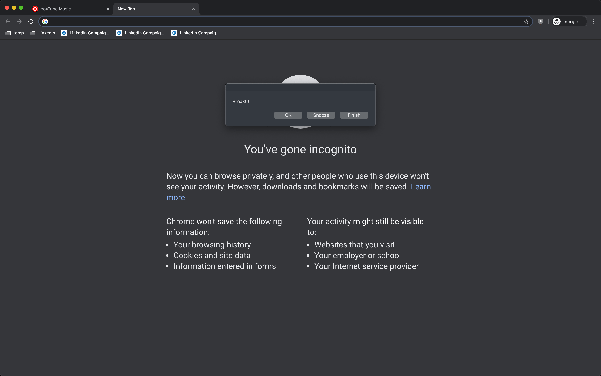

# Intro

- A python script running in an infinite loop, which will keep pestering you periodically to force you to take breaks.
- It can currently do the following tricks:
  - Display a dialog box which is hard to ignore/hide/minimize.
  - Play a sound on repeat.
  - Turn screen off.
- It can also pause itself while the screen is locked, to prevent the dialog and sound while the laptop is unattended.
- Note that when the screen is unlocked, the timer starts afresh, assuming that you would have already taken a break while you're gone.
- You are supposed to work without distractions for 30 minutes and then take a break for 5 minutes.
- The script will sleep for 25 minutes if you press `OK` and 5 minutes if you press `Snooze` before pestering you.  
- Snooze be used as both: a way to time the 5-minute break, or to extend the current working session for 5 minutes.
- The time intervals are configurable.
- To not the see the dialog ever again, press `Finish` to kill the script.
- Right now only supported on Mac.



# Setup

Execute it manually and run in background:
```
cd src
nohup python3 pomodoro.py &!
```

To make it run automatically at startup:
1. Configure the `.plist` file as per your needs:
    - Overwrite `'ajaggi'` with your username.
    - Modify all the directory paths to their correct values.
2. Copy the plist file to `~/Library/LaunchAgents`.

# Todo
- Add support for Windows and Linux:
  - If native screen state change notification observer API is missing, then create one using timer loops.
  - Find out equivalent commands for playing sound, turning off screen, displaying dialog.
- Get code reviewed.